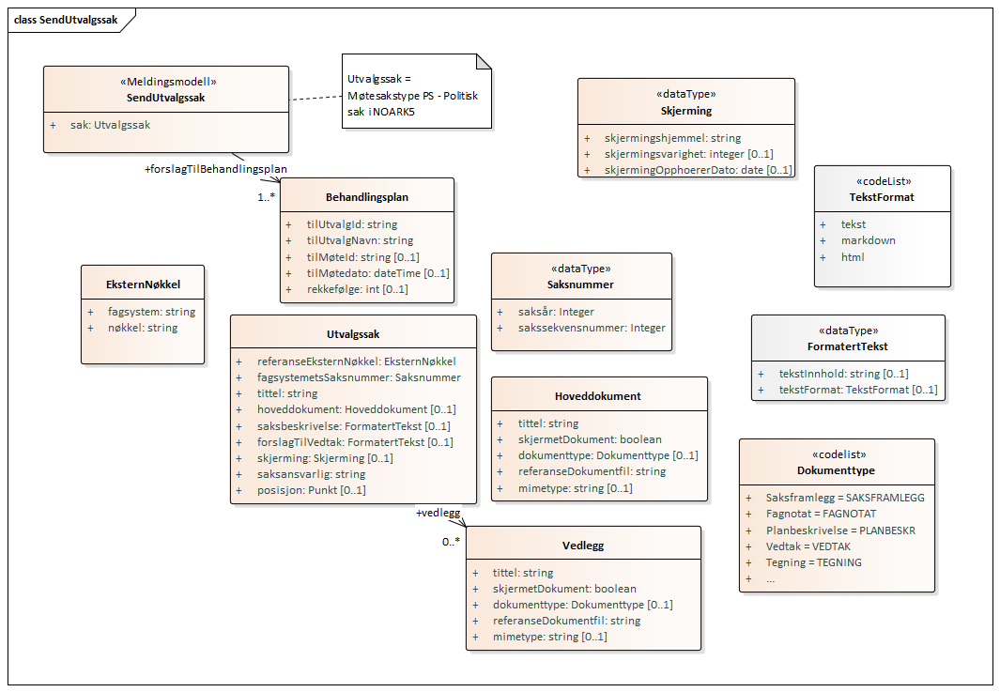

# Meldingsutveksling

Alle sekvensdiagrammer er forenklet med at man har utelatt Fiks-Protokoll som system mellom "Fagsystem", "Møtesystem" og "Arkivsystem".
Alle meldinger går via Fiks-Protokoll.

Sekvensdiagrammene er laget med PlantUML og kildekoden ligger i samme mappe som png-fil.

Klassediagrammene er generert i et verktøy tidligere i prosjektet og kan være utdatert. 
Vi ønsker å skrive de om til PlantUML slik at de lettere kan oppdateres.

## [Send delegert vedtak](delegertvedtak-send/README.md)

## [Send orienteringssak](orienteringssak-send/README.md)

## [Send utvalgssak](utvalgssak-send/README.md)

## [Send vedtak fra utvalg](vedtakfrautvalg-send/README.md)

### Klassediagram
*Merk at denne kan være litt utdatert*

### Sekvensdiagram
#### Send utvalgssak ok med mottat melding i retur

#### Send utvalgssak feiler med serverfeil i retur

#### Send utvalgssak feiler med ugyldigforespørsel i retur
