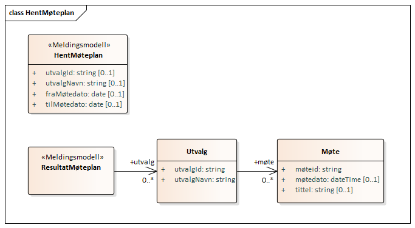
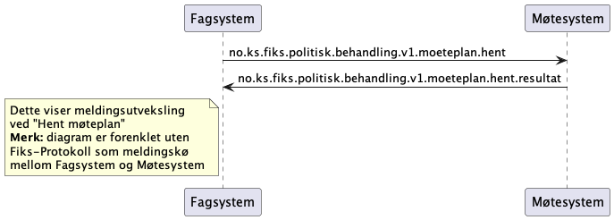
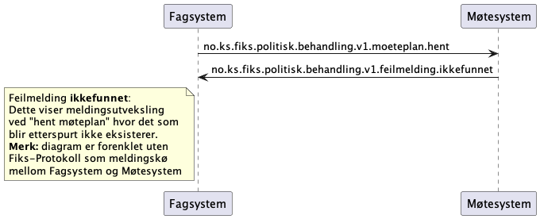
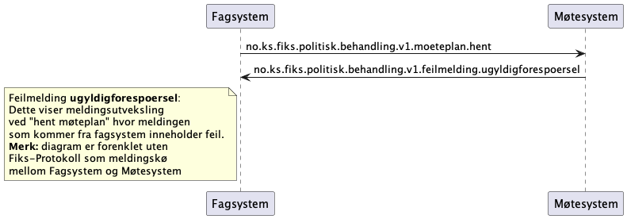
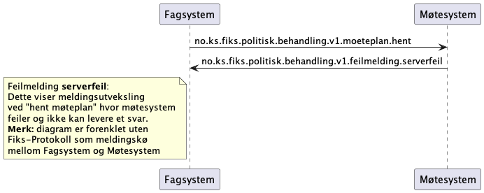

## Hent møteplan

### Klassediagram
*Merk at denne kan være litt utdatert*

### Sekvensdiagram
#### Hent møteplan ok med resultat melding i retur:

#### Hent møteplan feiler med ikke funnet i retur:
Det skal kun sendes en `ikkefunnet` melding hvis det er feil i hent-parameterene. 
Det skal ikke sendes en `ikkefunnet` hvis det ikke er funnet noen møter i perioden man har søket på.
Da skal det returneres et tomt resultat.

#### Hent møteplan feiler med ugyldigforespørsel i retur:

#### Hent møteplan feiler med serverfeil i retur:
