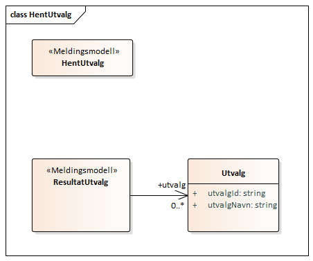
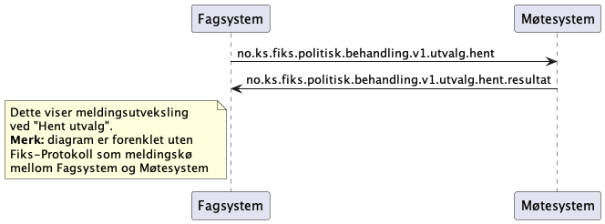
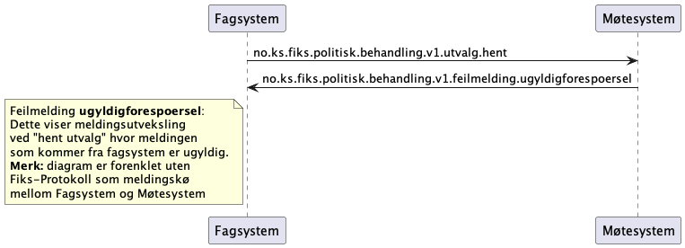
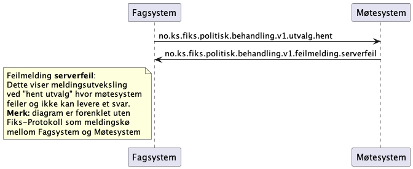

## Hent utvalg

Hent utvalg skal **ikke** bruke `ikkefunnet` feilmeldingen. Hvis det ikke er noe utvalg skal det returneres et tomt resultat.

### Klassediagram
*Merk at denne kan være litt utdatert*

### Sekvensdiagram
#### Hent utvalg ok med resultat-melding i retur:

#### Hent utvalg feiler med ugyldigforespørsel i retur:

#### Hent utvalg feiler med serverfeil i retur:
