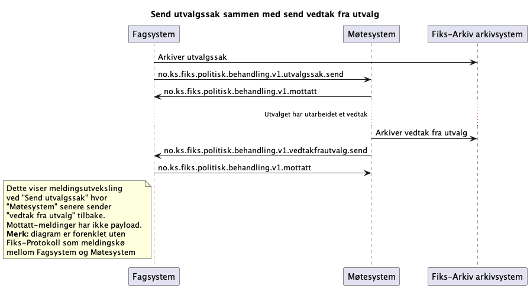

## Send utvalgssak og send vedtak fra utvalg tilbake

*Under arbeid* 

**Ordbok**:

Saksframlegg =   

### Sekvensdiagram
#### Send utvalgssak fra Fagsystem og send vedtak fra utvalg fra Møtesystem

