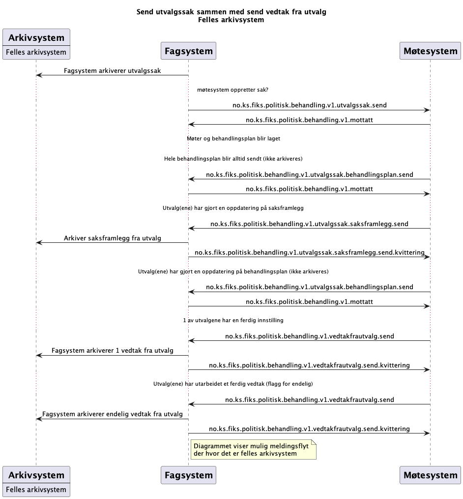
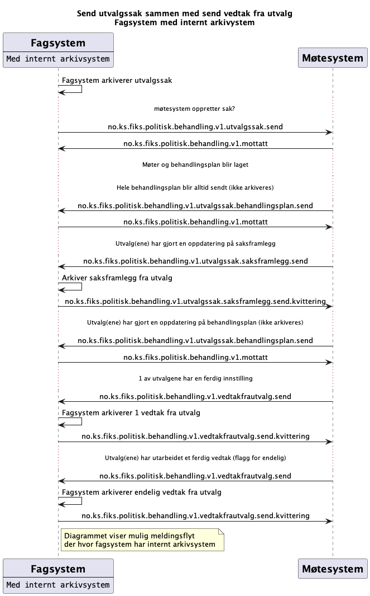

# Send utvalgssak og send vedtak fra utvalg tilbake

*Under arbeid* 

**Ordbok**:

*kommer* 

## Sekvensdiagram
### Send utvalgssak med 2 arkivsystem
Viser mulig meldingsflyt mellom Fagsystem og Møtesystem hvor de har **hvert sitt** arkivsystem. 

Dette er et forslag hvor det er introdusert noen ny meldingstyper for sending av `behandlingsplan` og `saksframlegg`

### Send utvalgssak med felles arkivsystem
Viser mulig meldingsflyt mellom Fagsystem og Møtesystem hvor de har **felles** arkivsystem.

Dette er et forslag hvor det er introdusert noen ny meldingstyper for sending av `behandlingsplan` og `saksframlegg`

### Send utvalgssak med felles arkivsystem og uten endring av saksframlegg

Viser mulig meldingsflyt mellom Fagsystem og Møtesystem hvor de har **felles** arkivsystem og man ikke sender oppdatering av `saksframlegg`.

Dette er et forslag hvor det er introdusert noen ny meldingstyper for sending av `behandlingsplan` og `saksframlegg` men man ikke bruker oppdatering av `saksframlegg`

### Send utvalgssak hvor fagsystem har internt arkivsystem

Viser mulig meldingsflyt mellom Fagsystem og Møtesystem hvor fagsystemet har eget internt arkivsystemn

Dette er et forslag hvor det er introdusert noen ny meldingstyper for sending av `behandlingsplan` og `saksframlegg` men man ikke bruker oppdatering av `saksframlegg`

