# Kontrakter og dokumentasjon for Fiks Politisk Behandling

*Under arbeid*

Json schemas og dokumentasjon for protokollen Fiks Politisk Behandling.

Videre arbeid med denne protokollen/standarden gjøres her. 

Schemas vil bli inkludert i pakker med genererte models basert på schemas i andre prosjekt for f.eks. .net og java.

### Dokumentasjon

For hver versjon av protokollen vil det følge en egen dokumentasjon som baserer seg på Markdown og PlantUML.
Når man gjør endringer i PlantUML koden kan man kjøre `generate-png-from-puml.sh` scriptet for å generere png filer ut av PlantUML koden.
Dette forutsetter at man har installert PlantUML og graphviz.

#### [Politisk Behandling V1](/Dokumentasjon/V1)

### Meldinger modeller

#### no.ks.fiks.politisk.behandling.v1.delegertvedtak.send
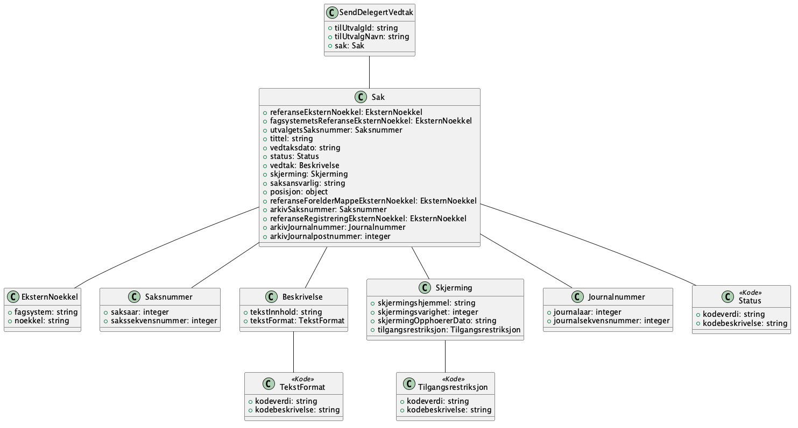

#### no.ks.fiks.politisk.behandling.v1.einnsyn.moeteplan.send
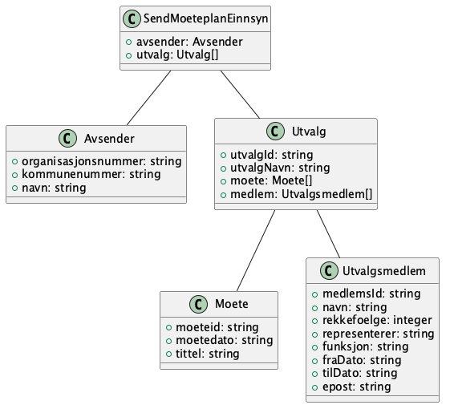

#### no.ks.fiks.politisk.behandling.v1.einnsyn.utvalgssaker.send
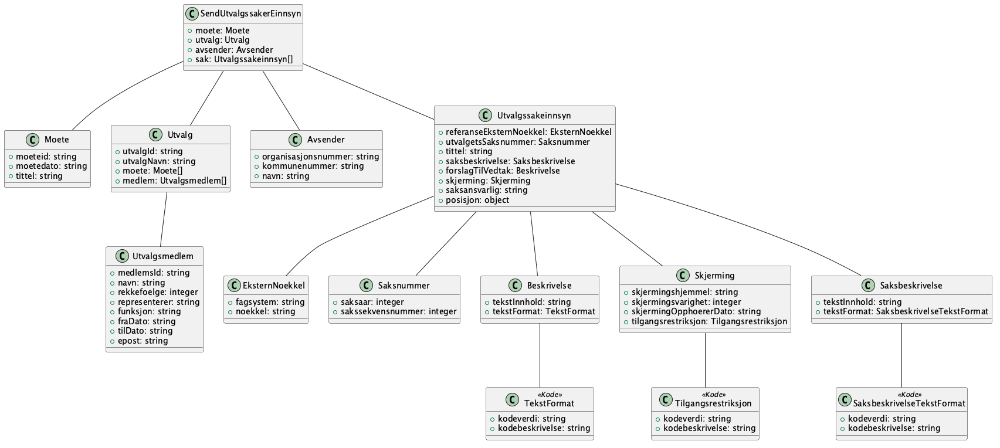

#### no.ks.fiks.politisk.behandling.v1.einnsyn.vedtak.send
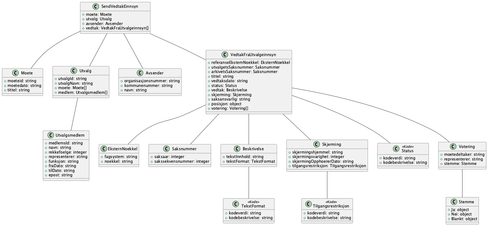

#### no.ks.fiks.politisk.behandling.v1.feilmelding.ikkefunnet
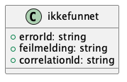

#### no.ks.fiks.politisk.behandling.v1.feilmelding.serverfeil
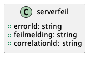

#### no.ks.fiks.politisk.behandling.v1.feilmelding.ugyldigforespoersel
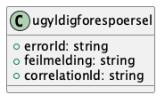

#### no.ks.fiks.politisk.behandling.v1.felles.beskrivelse
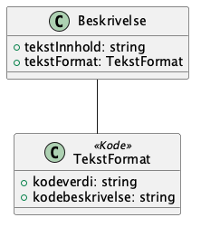

#### no.ks.fiks.politisk.behandling.v1.felles.eksternnoekkel
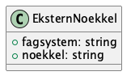

#### no.ks.fiks.politisk.behandling.v1.felles.journalnummer
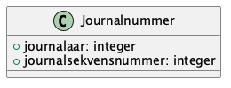

#### no.ks.fiks.politisk.behandling.v1.felles.moete
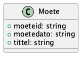

#### no.ks.fiks.politisk.behandling.v1.felles.saksnummer
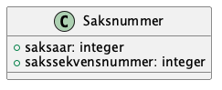

#### no.ks.fiks.politisk.behandling.v1.felles.skjerming
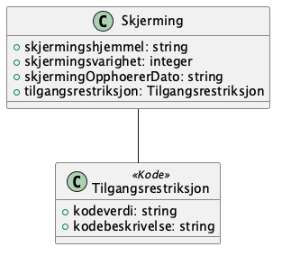

#### no.ks.fiks.politisk.behandling.v1.moeteplan.hent
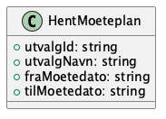

#### no.ks.fiks.politisk.behandling.v1.moeteplan.hent.resultat
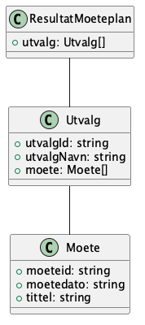

#### no.ks.fiks.politisk.behandling.v1.orienteringssak.send
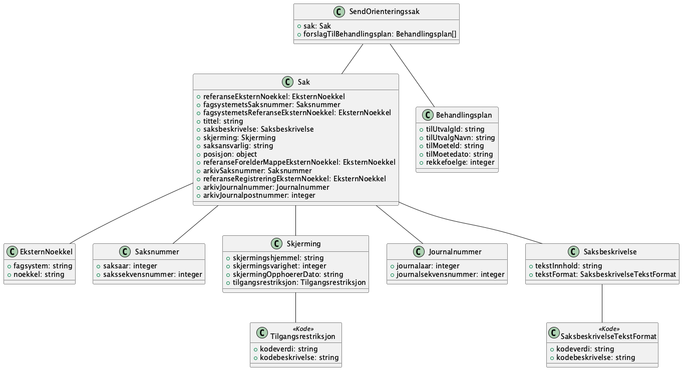

#### no.ks.fiks.politisk.behandling.v1.utvalg.hent
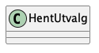

#### no.ks.fiks.politisk.behandling.v1.utvalg.hent.resultat
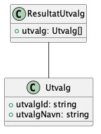

#### no.ks.fiks.politisk.behandling.v1.utvalgssak.send
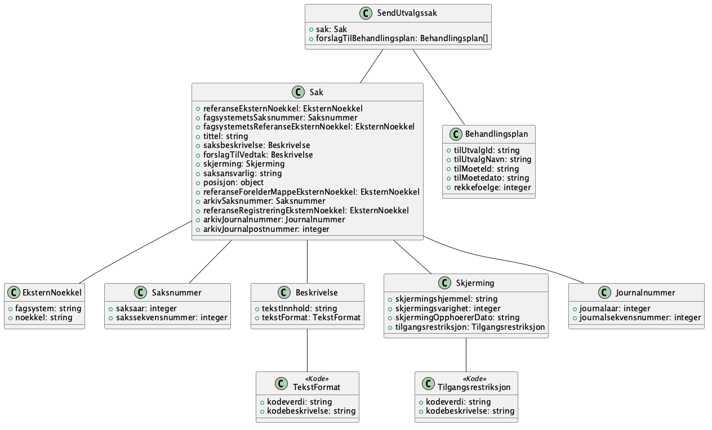

#### no.ks.fiks.politisk.behandling.v1.vedtakfrautvalg.send
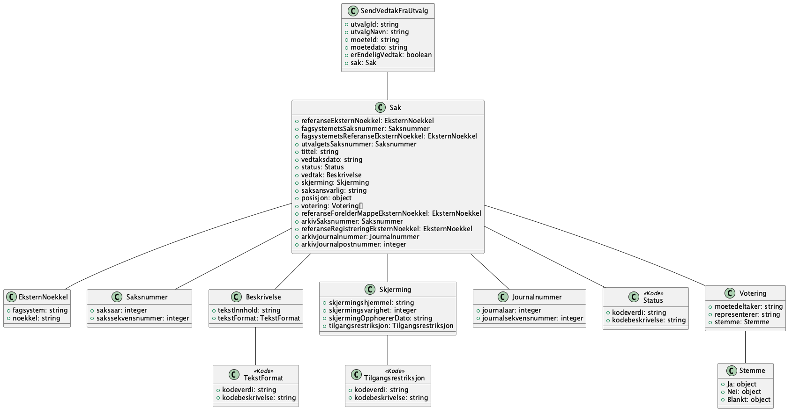

